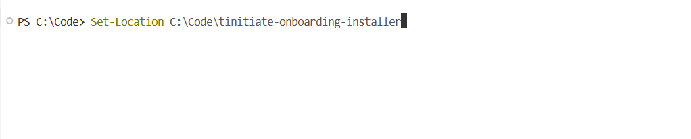
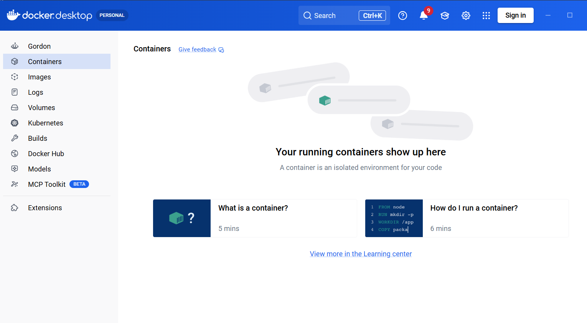
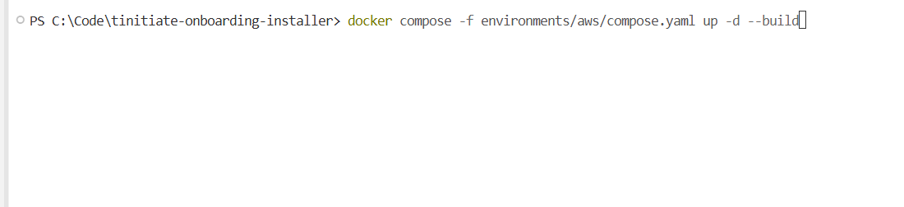
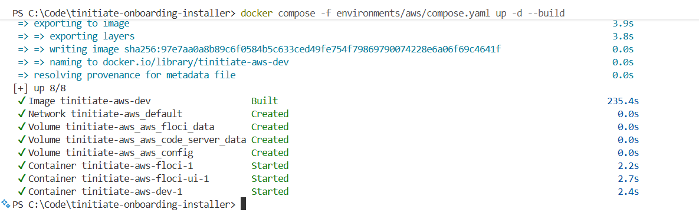

# Tinitiate Student Onboarding Installer

Set up your computer in two steps: **1. Install the base software. 2. Start one Docker environment for your course.**

> **New student? Start with the illustrated [step-by-step student guide](docs/STUDENT-GUIDE.md).** It explains which application to open, where to paste every command, what successful output looks like, and how to stop the appliance safely.

<p align="center">&copy; TINITIATE.COM</p>

## Step 1: install the base software

Run the installer for your computer once. It installs the following software and the configured Python libraries and VS Code extensions automatically. You do not need to install Python, Node.js, Git, Chocolatey, or Homebrew first; the installer sets them up.

You need an internet connection, permission to install applications, and a computer that can run Docker Desktop. Complete any Docker virtualization/WSL setup prompts and requested restarts before Step 2. Downloads and builds require internet access; hosted cloud exercises also need the accounts listed below.

| Software installed on your computer | Windows | macOS |
| --- | :---: | :---: |
| Docker Desktop | Yes | Yes |
| Notepad++ | Yes | Windows only |
| Visual Studio Code | Yes | Yes |
| DBeaver Community | Yes | Yes |
| Python and libraries | Yes | Yes |
| Node.js and npm | Yes | Yes |
| VS Code extensions | Yes | Yes |
| Git | Yes | Yes |
| Zoom | Yes | Yes |

Follow the Windows or macOS instructions below. **Finish Step 1 before starting Step 2.**

### Run the installer for your computer

#### Windows

On a new computer, **Git is not required to download the installer**:

1. Open the [project page](https://github.com/tinitiateprime/tinitiate-onboarding-installer) in your browser and select **Code > Download ZIP**.
2. Create `C:\Code` in File Explorer and extract the ZIP there.
3. Rename the extracted folder to `tinitiate-onboarding-installer`. Confirm it contains `windows\install.ps1`.

Open the **Start** menu, type **PowerShell**, right-click **Windows PowerShell**, and select **Run as administrator**. Select **Yes** if Windows asks for permission. Paste each line below and press **Enter** after each line:

```powershell
Set-Location C:\Code\tinitiate-onboarding-installer
Set-ExecutionPolicy Bypass -Scope Process -Force & .\windows\install.ps1
```

The first command opens the installer folder:



This installs the base software on Windows, including Docker Desktop. No `docker compose` command is needed to complete the base software installation. After the restart and Docker Desktop setup, start a course environment only when you need it.

Wait for the installation to finish, then restart Windows. If any software failed to install or a restart interrupted installation, run the installer again after restarting.


##### Verify

Open a new **PowerShell** window. Run each command below and check that it prints a version number:

```powershell
choco --version
python --version
python -m pip --version
node --version
npm --version
git --version
docker --version
docker compose version
code --version
```

Check the Python packages and VS Code extensions:

```powershell
python -m pip show pandas numpy requests pyspark jupyter pytest python-dotenv
code --list-extensions
```

The first command should show details for each Python package; the second should list the installed VS Code extensions.

If a command is unavailable, close and reopen PowerShell, then try again. If it still fails, run the Windows installer again. See the [Windows guide](windows/README.md#verify) for the same verification steps.

#### macOS

1. Open the [project page](https://github.com/tinitiateprime/tinitiate-onboarding-installer) and select **Code > Download ZIP**. No Git installation is needed.
2. Double-click the ZIP in Finder to extract it.
3. Open **Applications > Utilities > Terminal**. Type `cd ` (including the space), drag the extracted project folder into Terminal, and press **Enter**.
4. Run these commands one line at a time:

```bash
chmod +x macos/install.sh
./macos/install.sh
```

See [macOS installation and verification](macos/README.md).

## Step 2: choose one Docker course environment

Your instructor will tell you which course environment to use. A **course environment** is a ready-made set of tools and databases for your class. Docker Desktop runs it on your computer. If your instructor has not assigned an environment yet, stop after Step 1.

Start only your assigned environment. Docker sets up its included software automatically. You do not need to install the course databases or extra programming tools separately.

All choices except **On-premises databases** provide Python, Node.js, npm, Git, the shared libraries, extensions, and browser-based VS Code. On-premises databases starts database servers only; connect using the DBeaver installed in Step 1.

| Your course | Setup file used by Docker | Included course tools | Do you need a cloud account? |
| --- | --- | --- | --- |
| [AWS](environments/aws/README.md) | `environments/aws/compose.yaml` | AWS CLI, boto3, and Floci DB/data-lake/services | Optional for real AWS |
| [Azure](environments/azure/README.md) | `environments/azure/compose.yaml` | Azure CLI, SDKs, and Floci DB/data-lake/services | Optional for real Azure |
| [GCP](environments/gcp/README.md) | `environments/gcp/compose.yaml` | Google Cloud CLI, SDKs, and Floci DB/data-lake/services | Optional for real GCP |
| [Snowflake](environments/snowflake/README.md) | `environments/snowflake/compose.yaml` | Snowflake client workspace | Required for queries |
| [Oracle Developer](environments/oracle-developer/README.md) | `environments/oracle-developer/compose.yaml` | Oracle Database Free and Python Oracle tools | Not needed |
| [AI - AWS](environments/ai-aws/README.md) | `environments/ai-aws/compose.yaml` | Bedrock SDK, CrewAI, LangGraph, PostgreSQL/pgvector, and MinIO | Required for Bedrock |
| [AI - Azure](environments/ai-azure/README.md) | `environments/ai-azure/compose.yaml` | Foundry SDK, CrewAI, LangGraph, PostgreSQL/pgvector, and MinIO | Required for Foundry |
| [AI - Claude](environments/ai-claude/README.md) | `environments/ai-claude/compose.yaml` | Anthropic SDK, CrewAI, LangGraph, PostgreSQL/pgvector, and MinIO | API key required for Claude |
| [AI - Custom](environments/ai-custom/README.md) | `environments/ai-custom/compose.yaml` | OpenAI-compatible SDK, CrewAI, LangGraph, PostgreSQL/pgvector, and MinIO | Depends on model provider |
| [Databricks](environments/databricks/README.md) | `environments/databricks/compose.yaml` | Databricks tools plus AWS and Azure Floci data lakes | Required for remote workspace operations |
| [dbt](environments/dbt/README.md) | `environments/dbt/compose.yaml` | dbt, PostgreSQL, and AWS/Azure Floci data lakes | Depends on selected target |
| [On-premises databases](environments/onprem-db/README.md) | `environments/onprem-db/compose.yaml` | SQL Server, PostgreSQL with pgvector, and MySQL | Not needed |

The AWS, Azure, and GCP choices default to local Floci endpoints and dummy/local credentials where applicable. Students can learn without a paid cloud account. Snowflake and Databricks connect to real accounts after the student configures authentication; no credentials are stored in this repository. Snowflake does not provide a supported local server, so “local Snowflake” here means a local client workspace connected to Snowflake Cloud.

### Start your assigned course environment

Complete Step 1 first. Run the commands below in **PowerShell on Windows** or **Terminal on macOS**, from the downloaded project folder containing `compose.yaml`. Use the same folder you used for installation. Do not paste Docker commands into Python or the browser address bar.

1. Start Docker Desktop and wait until its engine is running. Run `docker version` (look for both Client and Server information), then `docker compose version`. Resolve any errors before continuing. No `.env` file is required for the classroom defaults.

   Docker Desktop may show an empty container list before you start your first environment:

   

2. Run **only the command for your selected environment**. For example, start AWS with:

```bash
docker compose -f environments/aws/compose.yaml up -d --build
```



For another course, copy only its command below:

**Azure**

```text
docker compose -f environments/azure/compose.yaml up -d --build
```

**GCP**

```text
docker compose -f environments/gcp/compose.yaml up -d --build
```

**Snowflake**

```text
docker compose -f environments/snowflake/compose.yaml up -d --build
```

**Oracle Developer**

```text
docker compose -f environments/oracle-developer/compose.yaml up -d --build
```

**AI - AWS**

```text
docker compose -f environments/ai-aws/compose.yaml up -d --build
```

**AI - Azure**

```text
docker compose -f environments/ai-azure/compose.yaml up -d --build
```

**AI - Claude**

```text
docker compose -f environments/ai-claude/compose.yaml up -d --build
```

**AI - Custom**

```text
docker compose -f environments/ai-custom/compose.yaml up -d --build
```

**Databricks**

```text
docker compose -f environments/databricks/compose.yaml up -d --build
```

**dbt**

```text
docker compose -f environments/dbt/compose.yaml up -d --build
```

**On-premises databases**

```text
docker compose -f environments/onprem-db/compose.yaml up -d
```

3. Wait for the download/build to finish and the terminal prompt to return. The first run can take several minutes. Check status using the same Compose file, for example `docker compose -f environments/aws/compose.yaml ps`. Services should be running; wait for databases to become healthy. If the command reports an error, see [student troubleshooting](docs/STUDENT-GUIDE.md#troubleshooting).

   Example AWS startup output:

   

4. Open <http://localhost:8080> and sign in with `Tinitiate!23456`. For AWS, Azure, and GCP, the Floci dashboard is at <http://localhost:4500>. AI appliances also expose MinIO at <http://localhost:9001>. **On-premises databases has no browser workspace**: open DBeaver and follow its [connection instructions](environments/onprem-db/README.md).

   Enter the classroom password and select **SUBMIT**:

   

   After sign-in, the VS Code workspace opens:

   

The classroom password is intended only for local student machines. Instructors can optionally copy `.env.example` to `.env` to override passwords, ports, regions, project IDs, and database settings.

Only run one student environment at a time unless you assign different ports in `.env`. To switch courses, run the current environment's `down` command before starting the next one.

Useful commands:

```bash
docker compose -f environments/aws/compose.yaml ps
docker compose -f environments/aws/compose.yaml logs -f dev
docker compose -f environments/aws/compose.yaml down
```

Replace `aws` with the selected environment. Use `docker compose -f environments/aws/compose.yaml down -v` only when you intentionally want to delete that environment's editor, CLI configuration, and emulator data volumes.

To resume later, start Docker Desktop and rerun your course's start command. Stopping with `down` keeps your saved files and database data. Do not add `-v`; that deletes saved Docker data.

### Verify the selected tools

Open the code-server terminal and run the matching commands:

```bash
# AWS
aws --version
aws s3 ls

# Azure
az version
az storage container list --connection-string "$AZURE_STORAGE_CONNECTION_STRING"

# GCP
gcloud version
gcloud storage buckets list

# Snowflake
snow --version

# Databricks
databricks version

# Oracle Developer
python -c "import oracledb; print(oracledb.connect(user='tinitiate', password='Tinitiate!23456', dsn='oracle:1521/FREEPDB1').version)"

# AI appliances
python -c "import crewai, langgraph, psycopg, minio; print('AI stack ready')"

# dbt
dbt --version
```

The cloud-specific Compose files intentionally mount the Docker socket into Floci. Floci needs it to create local containers for services such as functions and databases. Only use these teaching environments with trusted images and code.

## Python libraries

The same library list is used by both host installers and the Docker image. Edit [config/requirements.txt](config/requirements.txt) to change it.

## VS Code extensions

Desktop VS Code uses [config/vscode-extensions.txt](config/vscode-extensions.txt). Browser-based code-server uses [config/code-server-extensions.txt](config/code-server-extensions.txt), because Microsoft's Pylance extension is not distributed through the Open VSX marketplace; BasedPyright supplies equivalent Python type checking there.

## Troubleshooting

- Run the Windows installer from an elevated PowerShell window.
- Docker Desktop requires hardware virtualization; on Windows it may also request WSL 2 features and a restart.
- If `code` is not found immediately after installation, restart the terminal and rerun the installer.
- On macOS, Python libraries are installed in `~/.tinitiate/venv`. Activate it with `source ~/.tinitiate/venv/bin/activate`.
- Classroom defaults work without editing `.env`; configure cloud credentials only when your course requires them.
