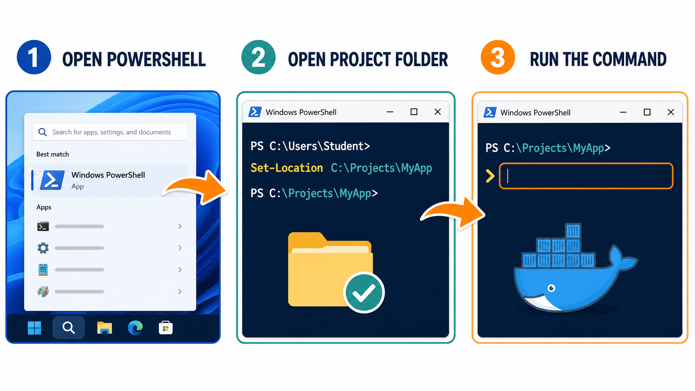
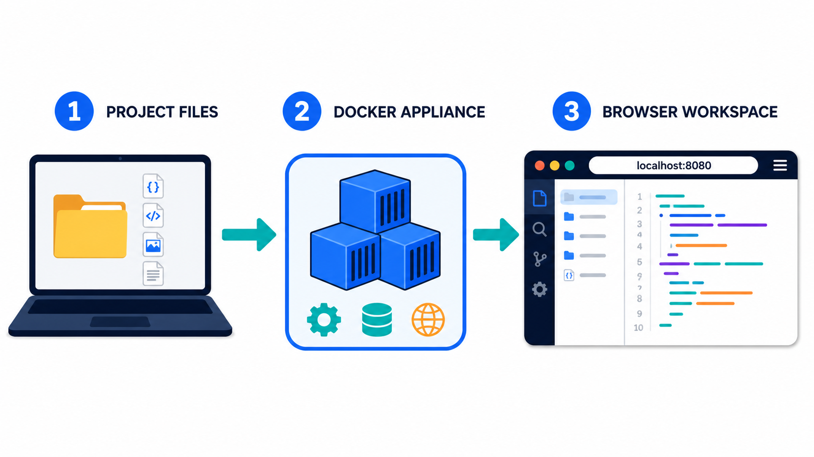
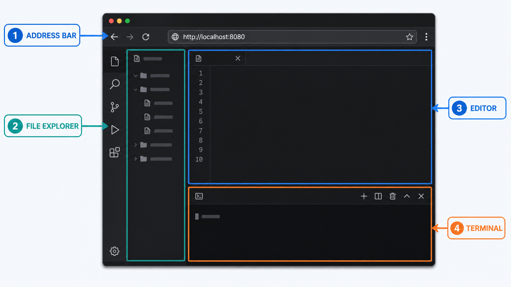
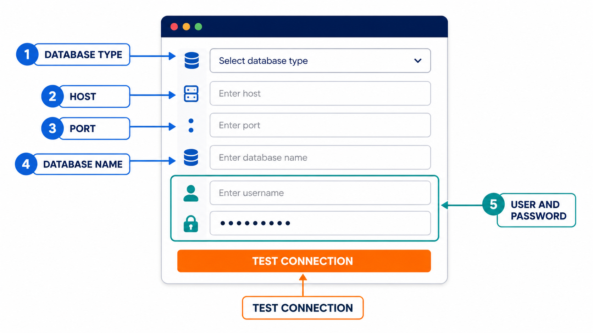

# Student guide: from a new computer to a running appliance

This guide assumes you have never used PowerShell, Terminal, Git, Docker, or VS Code. Follow the steps in order. Do not skip a restart when an installer asks for one.

## The two setup steps

**Step 1 — Install the base software once:** Docker Desktop, Notepad++ (Windows only), Visual Studio Code, DBeaver Community, Python and libraries, Java 21, IntelliJ IDEA, Node.js and npm, VS Code extensions, Git, Zoom, and Zoho Cliq. The installer sets up its package manager automatically. You do not need Git or Python installed before downloading the project as a ZIP.

**Step 2 — Start the tools for your course:** your instructor will tell you which environment to use, such as AWS, Azure, Oracle, or AI. A course environment is a ready-made set of tools and databases that Docker Desktop runs for your class. See the [course list and account requirements](../README.md#step-2-choose-one-docker-course-environment). Start only the environment your instructor assigns. If none has been assigned yet, finish Part 1 and stop there until your instructor gives you the course name.

Docker sets up the included course software automatically. You need internet access, permission to install applications, and Docker Desktop running on your computer. Some lessons also need a cloud account or an API key (a secret code that lets you use an online service). Your instructor will provide the account instructions when needed.

## Follow these actions in order

1. Install the desktop software once.
2. Start Docker Desktop.
3. Open PowerShell or Terminal.
4. Move into the downloaded project folder.
5. Start one learning appliance.
6. Open the browser workspace.
7. Stop the appliance when finished.



## Words used in this guide

- **Command:** text you type or paste into PowerShell or Terminal and then run by pressing **Enter**.
- **Repository:** the downloaded `tinitiate-onboarding-installer` project folder.
- **Repository root:** the main project folder containing `README.md`, `compose.yaml`, `windows`, `macos`, and `environments`.
- **Docker image:** a packaged software template downloaded or built by Docker.
- **Container:** a running instance of an image.
- **Appliance:** the complete group of containers for one course environment.
- **code-server:** VS Code running in a browser at <http://localhost:8080>.
- **localhost:** your own computer. It is not a public website.

## Part 1: install the local software

Do this part once on a new computer. If the software was already installed by your instructor, continue to [Part 2](#part-2-start-docker-desktop).

### Windows

1. Open the Windows **Start** menu and type `PowerShell`.
2. Right-click **Windows PowerShell** and select **Run as administrator**.
3. Select **Yes** when prompted.
4. Paste this single command and press **Enter**:

```powershell
iex (Invoke-WebRequest -Uri "https://raw.githubusercontent.com/tinitiateprime/tinitiate-onboarding-installer/main/windows/install.ps1" -UseBasicParsing).Content
```

5. Wait until `Tinitiate student software installation is complete.` appears.
6. Restart Windows.

This installs the basic tools, Python, Java, and their extensions automatically. See the [Windows verification commands](../windows/README.md#verify) to check the installation.

### macOS

1. Open **Terminal** from **Applications** > **Utilities** > **Terminal**.
2. Open the [project page](https://github.com/tinitiateprime/tinitiate-onboarding-installer) in your browser, select **Code > Download ZIP**, and double-click the downloaded ZIP in Finder to extract it. This works without Git installed.
3. In Terminal, type `cd ` with a space after it.
4. Drag the `tinitiate-onboarding-installer` folder from Finder into Terminal. macOS inserts its full path.
5. Press **Enter**.
6. Run these commands separately:

```bash
chmod +x macos/install.sh
```

```bash
./macos/install.sh
```

7. Follow any macOS permission prompts.
8. Open Docker Desktop once after the installer finishes.

See the [complete macOS setup guide](../macos/README.md) for verification and Python environment instructions.

## Part 2: start Docker Desktop

Docker commands work only while Docker Desktop is running.

### Windows

1. Open the Windows **Start** menu.
2. Type `Docker Desktop`.
3. Select **Docker Desktop**.
4. Accept any license, WSL 2, or update prompts.
5. Wait until Docker Desktop says the engine is running. First startup can take several minutes.

### macOS

1. Open **Applications**.
2. Select **Docker**.
3. Wait until Docker Desktop reports that the engine is running.

### Confirm Docker is ready

Open a normal PowerShell window on Windows or Terminal on macOS. Do not use an Administrator window for everyday course work.

Run:

```text
docker version
```

Then run:

```text
docker compose version
```

Successful `docker version` output contains both **Client** and **Server** information; `docker compose version` prints a Compose version. If the output says it cannot connect to the Docker daemon or engine, return to Docker Desktop and wait until it is running.

## Part 3: open the repository root

Every appliance command must be run from the repository root.

### Windows PowerShell

For this course setup step, [download the project ZIP](https://github.com/tinitiateprime/tinitiate-onboarding-installer/archive/refs/heads/main.zip), extract it into `C:\Code`, and rename the extracted folder to `tinitiate-onboarding-installer`.

Open **Start**, type `PowerShell`, open **Windows PowerShell**, and run:

```powershell
Set-Location C:\Code\tinitiate-onboarding-installer
```

Confirm the location:

```powershell
Get-Location
```

Confirm the project files are present:

```powershell
Get-ChildItem
```

You should see `README.md`, `compose.yaml`, `environments`, `windows`, and `macos`.

### macOS Terminal

Run `cd` followed by the actual path where you downloaded the repository. For example:

```bash
cd ~/Code/tinitiate-onboarding-installer
```

Confirm the location and files:

```bash
pwd
ls
```

You should see `README.md`, `compose.yaml`, `environments`, `windows`, and `macos`.

## Part 4: choose exactly one appliance

Run only one appliance at a time unless an instructor tells you otherwise. Multiple appliances use the same ports and will conflict.



Find the course name given by your instructor below. Copy only the command under that name into PowerShell or Terminal and press **Enter**. Make sure you opened the project folder as shown in Part 3. Do not run the commands for other courses.

### AWS Data Engineering

```text
docker compose -f environments/aws/compose.yaml up -d --build
```

### Azure Data Engineering

```text
docker compose -f environments/azure/compose.yaml up -d --build
```

### GCP Data Engineering

```text
docker compose -f environments/gcp/compose.yaml up -d --build
```

### Snowflake

```text
docker compose -f environments/snowflake/compose.yaml up -d --build
```

### Oracle Developer

```text
docker compose -f environments/oracle-developer/compose.yaml up -d --build
```

### AI - AWS Bedrock

```text
docker compose -f environments/ai-aws/compose.yaml up -d --build
```

### AI - Azure Foundry

```text
docker compose -f environments/ai-azure/compose.yaml up -d --build
```

### AI - Claude

```text
docker compose -f environments/ai-claude/compose.yaml up -d --build
```

### AI - Custom model

```text
docker compose -f environments/ai-custom/compose.yaml up -d --build
```

### Databricks

```text
docker compose -f environments/databricks/compose.yaml up -d --build
```

### dbt

```text
docker compose -f environments/dbt/compose.yaml up -d --build
```

### On-premises databases

```text
docker compose -f environments/onprem-db/compose.yaml up -d
```

## Part 5: understand the first startup

After you press **Enter**, Docker displays download and build messages. This is normal.

- The first startup can take 10–30 minutes depending on internet speed and computer performance.
- Lines beginning with `Pulling`, `Downloading`, `Extracting`, or `Building` are normal.
- Do not close Docker Desktop during the build.
- The command is finished when PowerShell or Terminal shows its prompt again.
- `Started` or `Running` indicates success.

Check the appliance status by running the `ps` form of the same command. Example for Azure:

```text
docker compose -f environments/azure/compose.yaml ps
```

The `STATUS` column should say `Up`, `running`, or `healthy`. A database may display `starting` for several minutes before it becomes healthy.

## Part 6: open the browser workspace

**On-premises databases students:** this choice starts SQL Server, PostgreSQL, and MySQL by default, with optional Oracle and DynamoDB Local in the [database guide](../environments/onprem-db/README.md). Skip the browser workspace and go to [Connect with DBeaver](#connect-with-dbeaver) for SQL databases. All other choices include the browser workspace below.

1. Open Chrome, Edge, Firefox, or Safari.
2. Select the address bar at the top of the browser.
3. Type exactly:

```text
http://localhost:8080
```

4. Press **Enter**.
5. If a password screen appears, enter:

```text
Tinitiate!23456
```

This password is only for the local classroom workspace.



### Open a terminal inside the browser workspace

1. Select **Terminal** from the menu at the top.
2. Select **New Terminal**.
3. A terminal panel opens at the bottom of the page.
4. Run course verification commands in this terminal, not in the browser address bar.

### Open course files

1. Select the **Explorer** icon near the upper-left corner.
2. Expand folders by selecting the arrow beside the folder name.
3. Select a file to open it in the editor.
4. Changes are saved into the project folder on your computer.

## Part 7: open the other local pages

Only open pages provided by your selected appliance.

| Appliance | Page | Address |
| --- | --- | --- |
| AWS, Azure, or GCP | Floci dashboard | <http://localhost:4500> |
| Any AI appliance | MinIO data-lake console | <http://localhost:9001> |
| Every appliance with a workspace | code-server | <http://localhost:8080> |

MinIO uses the default user `tinitiate` and password `Tinitiate!23456` unless the instructor changed `.env`.

Database ports such as 5432, 1433, 1521, and 3306 are for DBeaver or application connections; they are not web pages.

### Connect with DBeaver

Use this section for Oracle Developer or the on-premises database appliance.

1. Wait until the database service is `healthy` in the appliance `ps` output.
2. Open the Windows **Start** menu or macOS **Applications** folder.
3. Open **DBeaver**.
4. Select **Database** > **New Database Connection**.
5. Select the database type: **Oracle**, **SQL Server**, **PostgreSQL**, or **MySQL**.
6. Select **Next**.
7. Enter the connection values from the table below.
8. Select **Test Connection**.
9. If DBeaver asks to download a driver, select **Download** and wait for it to finish.
10. When `Connected` appears, select **Finish**.



| Database | Host | Port | Database or service | User | Default password |
| --- | --- | ---: | --- | --- | --- |
| Oracle | `localhost` | 1521 | `FREEPDB1` | `tinitiate` | `Tinitiate!23456` |
| SQL Server | `localhost` | 1433 | `master` | `sa` | `Tinitiate!23456` |
| PostgreSQL | `localhost` | 5432 | `tinitiate` | `tinitiate` | `Tinitiate!23456` |
| MySQL | `localhost` | 3306 | `tinitiate` | `tinitiate` | `Tinitiate!23456` |

For SQL Server in a local classroom environment, enable **Trust server certificate** if DBeaver asks about encryption.

## Part 8: verify your selected appliance

Run these commands in the terminal inside code-server.

For On-premises databases, use **Test Connection** in DBeaver for each database instead; that environment does not include code-server.

### AWS

```bash
aws --version
aws s3 ls
```

### Azure

```bash
az version
az storage container list --connection-string "$AZURE_STORAGE_CONNECTION_STRING" --output table
```

### GCP

```bash
gcloud version
gcloud storage buckets list
```

### Snowflake

```bash
snow --version
```

Queries require a Snowflake Cloud account configured by your instructor.

### Oracle Developer

```bash
python -c "import oracledb; print(oracledb.connect(user='tinitiate', password='Tinitiate!23456', dsn='oracle:1521/FREEPDB1').version)"
```

### AI - AWS

```bash
python -c "import boto3, crewai, langgraph, psycopg, minio; print('AI AWS appliance is ready')"
```

### AI - Azure

```bash
python -c "import azure.ai.projects, crewai, langgraph, psycopg, minio; print('AI Azure appliance is ready')"
```

### AI - Claude

```bash
python -c "import anthropic, crewai, langgraph, psycopg, minio; print('AI Claude appliance is ready')"
```

### AI - Custom

```bash
python -c "import openai, crewai, langgraph, psycopg, minio; print('AI custom appliance is ready')"
```

### Databricks

```bash
databricks version
python -c "import databricks.sdk, databricks.sql, delta; print('Databricks appliance is ready')"
```

### dbt

```bash
dbt --version
```

## Part 9: stop and restart an appliance

Stopping an appliance does not delete your project files or saved Docker volumes.

1. Return to the PowerShell or Terminal window on your computer.
2. Make sure it is at the repository root.
3. Run the `down` form of the command for the appliance you started.

Azure example:

```text
docker compose -f environments/azure/compose.yaml down
```

To start it again later, start Docker Desktop, open the repository root, and rerun:

```text
docker compose -f environments/azure/compose.yaml up -d
```

You usually need `--build` only on the first start or after project setup files change.

To switch to another course, stop the current environment using its own setup file first, then run the new course's start command from Part 4.

Do not add `-v` to `down` unless an instructor explicitly asks you to erase saved appliance data.

## Part 10: change optional settings safely

Most students do not need a `.env` file. Create one only when an instructor provides different ports, passwords, or cloud settings.

From the repository root on Windows:

```powershell
Copy-Item .env.example .env
notepad .env
```

On macOS:

```bash
cp .env.example .env
open -e .env
```

Save the file, stop the appliance, and start it again. Never post API keys, tokens, or passwords in chat, screenshots, email, or Git.

### Configure an AI provider only when required

The local database, vector database, MinIO data lake, CrewAI, and LangGraph work without cloud credentials. Credentials are needed only when course code calls a hosted model.

1. Ask the instructor which provider and account to use.
2. Create `.env` using the command above.
3. Open `.env` in Notepad or TextEdit.
4. Find the matching variables below and enter values supplied through an approved secure method.
5. Save `.env`, stop the appliance, and start it again.

| Appliance | Variables to complete |
| --- | --- |
| AI - AWS | `AWS_ACCESS_KEY_ID`, `AWS_SECRET_ACCESS_KEY`, optional `AWS_SESSION_TOKEN`, and `AWS_DEFAULT_REGION` |
| AI - Azure | `AZURE_AI_PROJECT_ENDPOINT`, `AZURE_AI_MODEL_DEPLOYMENT_NAME`, `AZURE_CLIENT_ID`, `AZURE_TENANT_ID`, and `AZURE_CLIENT_SECRET` |
| AI - Claude | `ANTHROPIC_API_KEY` |
| AI - Custom | `CUSTOM_AI_BASE_URL`, `CUSTOM_AI_API_KEY`, and `CUSTOM_AI_MODEL` |

The `.gitignore` file excludes `.env`, but students must still treat it as a secret file. Never copy its contents into a notebook, source file, screenshot, or Git commit.

## Troubleshooting

### `docker` is not recognized

Close PowerShell or Terminal, restart the computer, start Docker Desktop, and open a new terminal. If the problem remains, rerun the host installer.

### Cannot connect to the Docker daemon or engine

Docker Desktop is not running yet. Open it and wait for the engine-running message.

### `no configuration file provided`

You are in the wrong folder. Return to [Part 3](#part-3-open-the-repository-root).

### `port is already allocated` or `address already in use`

Another appliance or program is using the same port. Stop the previous appliance. To see running containers:

```text
docker ps
```

If you recognize the previous course appliance, return to its guide and run its `down` command.

### Browser says the page cannot be reached

1. Confirm Docker Desktop is running.
2. Confirm you used `http://`, not `https://`.
3. Run the appliance `ps` command.
4. If the service is still `starting`, wait and try again.
5. View logs using the same Compose file. Azure example:

```text
docker compose -f environments/azure/compose.yaml logs --tail 100
```

### A database stays in `starting`

Oracle and SQL Server can take several minutes and need more memory. Open Docker Desktop settings and allow at least 4 GB of memory when those appliances are used.

### A cloud command asks you to sign in

Local Floci exercises do not need a real AWS, Azure, or GCP account. A Snowflake, Databricks, Bedrock, Foundry, or Claude exercise may require credentials supplied or approved by your instructor. Do not create paid resources unless your instructor directs you to do so.

### Get help from an instructor

Send the instructor:

1. The appliance name.
2. The exact command you ran.
3. The complete error text.
4. The output from the appliance `ps` command.
5. The last 100 log lines, with secrets removed.

Do not send `.env`, access keys, API keys, passwords, or tokens.
